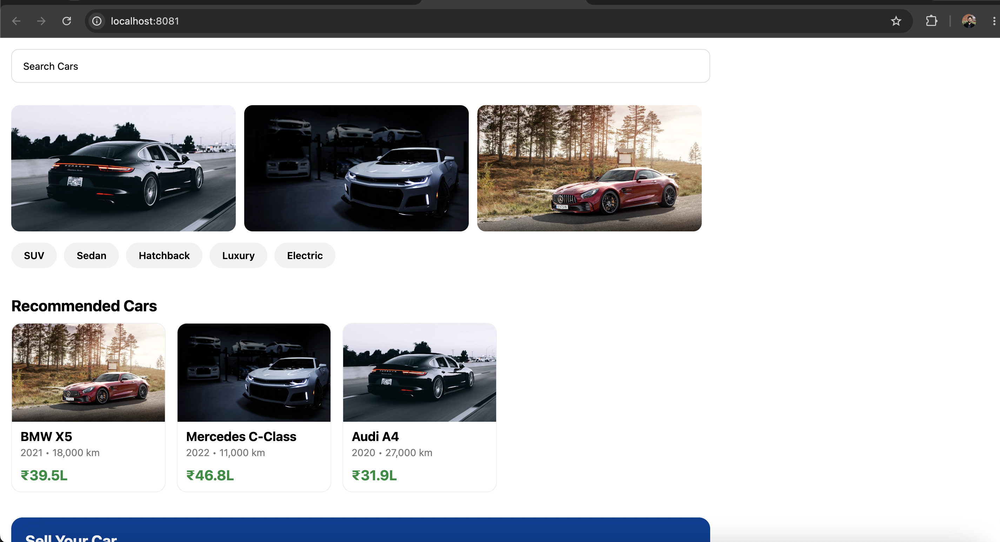

# Cars24 SDUI

## Project Overview

Cars24 SDUI is a React Native + Expo project that demonstrates a simple Schema-Driven UI (SDUI) approach for building a car-buying style home screen. The project contains both a direct, statically composed screen and an SDUI layer that can render UI from a JSON schema using a component registry and renderer.

The current implementation focuses on a sample home experience for a car marketplace UI, with reusable components and a schema-driven rendering pipeline.

## Features

- A static home screen built with React Native components
- A schema-driven UI architecture powered by JSON definitions
- A component registry that maps component types to implementations
- A renderer that dynamically renders components from schema data
- Action handling for CTA interactions using toast, log, and navigate-style actions
- Support for a set of reusable UI components such as search bars, banners, chips, car cards, section titles, CTA sections, and a footer
- A fallback component for unsupported or unknown component types

## Architecture

The project is organized around two complementary rendering approaches:

1. Static UI layer
   - The app entry point renders a screen composed directly from React Native components.
   - This is implemented in the screen layer and is useful for comparing traditional UI composition against schema-driven rendering.

2. SDUI layer
   - A JSON schema defines the screen structure.
   - The renderer reads the schema and resolves each component through a registry.
   - Component implementations are supplied by the component files under the components folder.
   - CTA actions are executed through a shared action handler.

This structure helps demonstrate how UI can be driven by schema instead of writing all screen content directly in JSX.

## Folder Structure

```text
src/
  components/
    BannerCarousel/
    CarCard/
    CategoryChips/
    CTASection/
    Footer/
    HorizontalRail/
    SearchBar/
    SectionTitle/
    UnknownComponent/
  core/
    actions/
    parser/
    registry/
    renderer/
  screens/
    StaticHomeScreen.tsx
  schemas/
    home.json
  types/
    ComponentModel.ts
    ComponentTypes.ts
```

## Installation

Make sure you have Node.js and Expo installed, then run:

```bash
npm install
```

## Running the Project

Start the development server:

```bash
npm start
```

You can also run the app on a platform-specific target:

```bash
npm run android
npm run ios
npm run web
```

## SDUI Workflow

The SDUI flow implemented in this project is:

1. A screen schema is defined in JSON.
2. The schema is loaded by the app.
3. The renderer iterates through the component list.
4. Each component type is resolved using the component registry.
5. The mapped component is rendered with its props.
6. Any action attached to the component is passed to the action handler.

This workflow is implemented in the following files:

- src/schemas/home.json
- src/core/registry/ComponentRegistry.ts
- src/core/renderer/Renderer.tsx
- src/core/actions/ActionHandler.ts

## Static UI vs SDUI Comparison

| Approach | How it works | Current status in this project |
| --- | --- | --- |
| Static UI | Components are composed directly in JSX | Implemented in the home screen component |
| SDUI | Components are rendered from a JSON schema and registry | Implemented in the renderer and schema layer |

This comparison is useful for understanding the difference between explicit screen composition and schema-driven rendering.

## Supported Components

The following components are currently implemented and wired into the registry:

- SearchBar
- BannerCarousel
- CategoryChips
- SectionTitle
- HorizontalRail
- CarCard
- CTASection
- Footer
- UnknownComponent (fallback)

## JSON Schema Example

The current schema is defined in src/schemas/home.json. A representative example from the project is shown below:

```json
{
  "screenId": "home",
  "version": 1,
  "components": [
    {
      "id": "search",
      "type": "searchBar",
      "props": {
        "placeholder": "Search Cars"
      }
    },
    {
      "id": "banner",
      "type": "bannerCarousel",
      "props": {
        "images": [
          "https://images.unsplash.com/photo-1503376780353-7e6692767b70?w=1200"
        ]
      }
    },
    {
      "id": "sellCar",
      "type": "ctaSection",
      "props": {
        "title": "Sell Your Car",
        "subtitle": "Get Best Price",
        "buttonText": "Book Free Inspection"
      },
      "action": {
        "type": "toast",
        "payload": {
          "message": "Inspection Booked Successfully!"
        }
      }
    }
  ]
}
```

## Screenshots

The following screenshots document the application UI:

### Home Screen


### Search Bar


### Recommended Cars


### CTA Section


## Future Improvements

Potential next steps for this project include:

- Adding schema validation for JSON screen definitions
- Expanding support for more component types
- Improving the footer component to match the rest of the UI
- Adding a visual demo screen for the SDUI renderer
- Introducing richer actions such as navigation and dynamic state updates

## Learning Outcomes

This project demonstrates:

- The difference between static UI composition and schema-driven rendering
- How a simple component registry can decouple UI definitions from implementation
- How JSON can be used as a lightweight screen configuration layer
- How reusable React Native components can be composed into a single experience
- The basics of action handling in a UI-driven architecture
